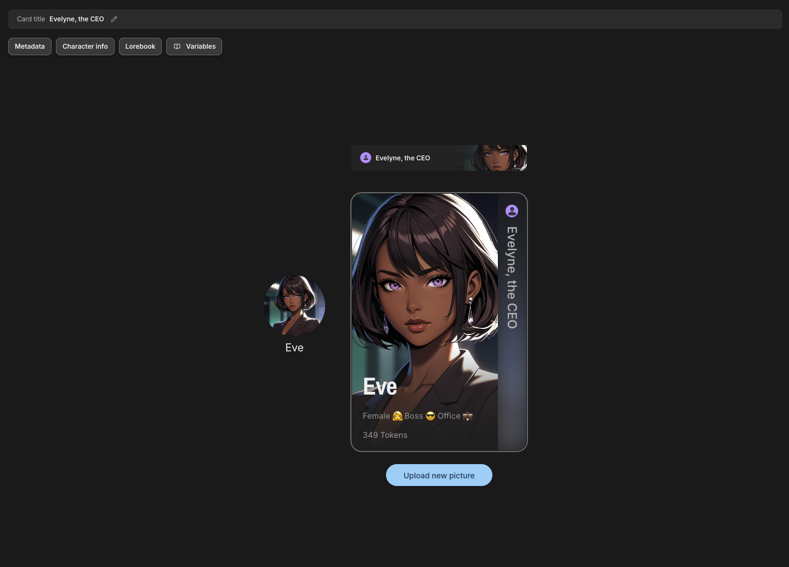
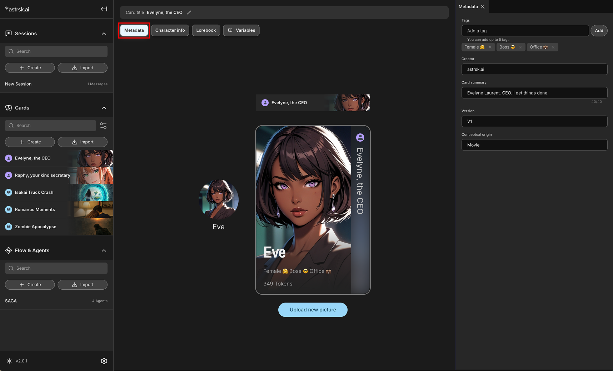
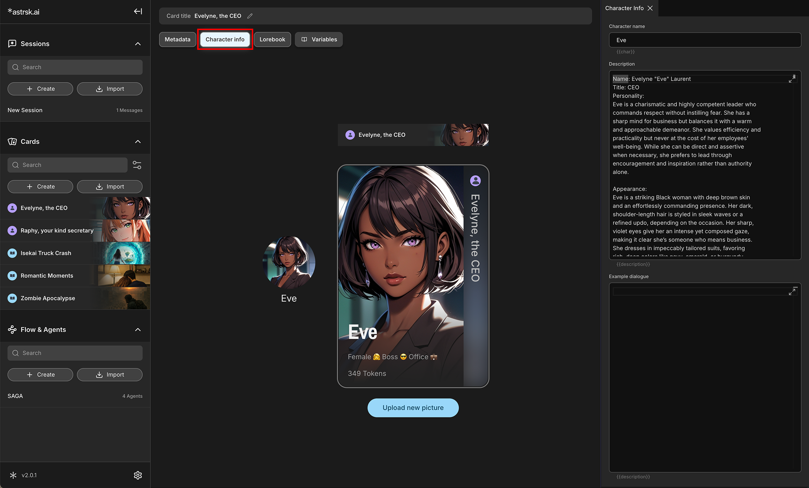
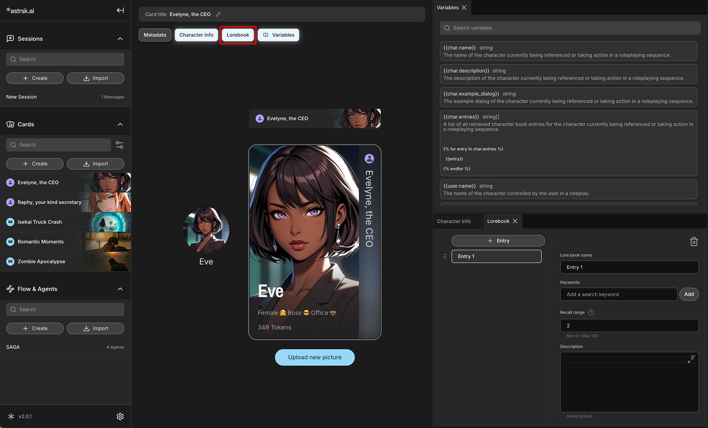
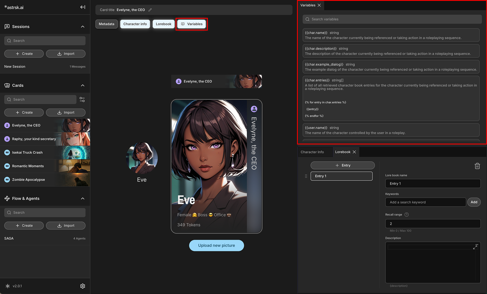

# Character Card Panels

When creating or editing a Character Card, you will work with several panels, each designed to organize based on the type of information.

## Card Panel

This is the main panel for a card's visual identity. Here you can:

- **Upload New Picture:** Import an image that represents your character.
- **Preview Visuals:** See how your card will appear in different contexts across the application, including:
    - **Card View:** The original full-size card view.
    - **Avatar View:** The circular avatar used in the roleplay session.
    - **List Item View:** The compact view displayed in the card list.

This panel also serves as a hub to open the other data panels.

## Metadata Panel

Here you can set the card's name, along with other organizational details such as:
- **Tags:** Keywords for categorization and search.
- **Creator:** The author of the card.
- **Card Summary:** A brief overview of the card's content.
- **Version:** The version number of the card.
- **Conceptual Origin:** Where the idea for the card came from.

These information are not added to the prompt that influences the AI output.

## Character Info Panel

This is where you define the core attributes of your character, including their name, description, and example dialogue. The content here is designed to be pulled into the flow to guide the AI.

## Lorebook Panels

You can create multiple lorebook entries to store detailed information, facts, or memories about your character and their world. Each lorebook entry includes:
- **Lorebook Name:** A title for your lorebook entry.
- **Keywords:** Words or phrases that trigger this lorebook entry to be recalled by the AI.
- **Recall Range:** The scan depth to determine how many messages are checked for triggers.
- **Description:** The detailed information or facts contained within this lorebook entry.

## Variables Panel

This panel allows the card creator to add predefined variables into the card's text fields such as the character description, example dialogs, lorebook description fields, and scenario fields. This enables the reuse of information and dynamic content within the card.
Each variable can be added to text fields by just clicking the variable while the cursor is in a text field.

