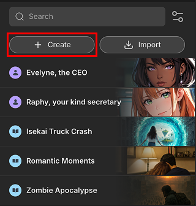

# Create a Card

## Getting Started

Click the [+ Create] button located at the top of the card list in the *resource panel*.

## Select Card Type

First, choose whether you want to create a **Character Card** or a **Plot Card**. This selection determines the fields and panels available for you to fill out.
Add a card name and click [Create], you will be able to start editing the new card in detail.

## Adding Card Information

The information that you add in the text fields will define your character's personality or the story's plot. The card creation interface uses several panels to organize this information.

- **For Character Cards,** Character cards consist of Metadata, Character Info, Lorebook, and Variables panels to define your character. See the [Character Card Panels](./character-card.md) guide for a detailed explanation of each panel.
- **For Plot Cards,** Plot cards consist of Metadata, Plot Info, Lorebook, Scenarios, and Variables panels to define your plot. See the [Plot Card Panels](./plot-card.md) guide for a detailed explanation of each panel.
