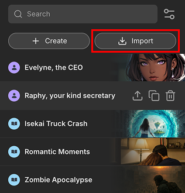
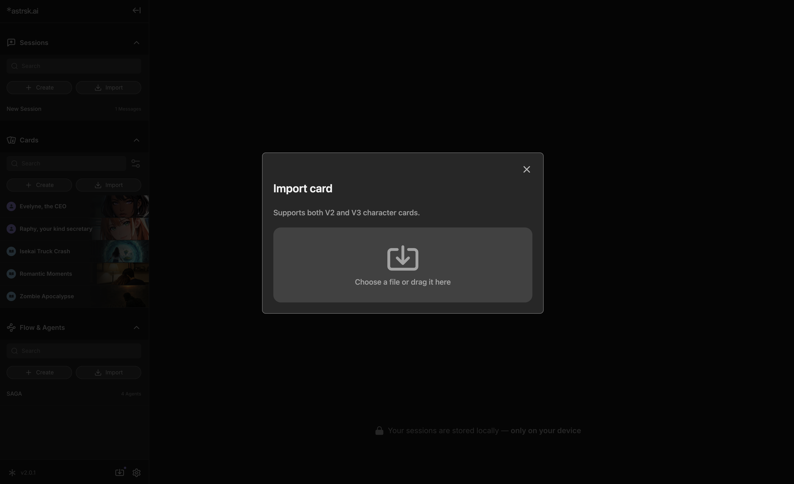

# Import a Card

## Press the "Import" button

Click the "Import" button located at the top of the card list in the *resource panel*. This opens a file selection window, allowing you to bring in external card files.

## Select Card Files to Import

You can import V2, V3, or astrsk.ai card files. Once selected, they will be added to cards list to be used in roleplay sessions.

## Important Notes

- **Acceptable File Formats:** The imported files must be in **PNG** format.
- **Splitting V2/V3 Cards:** When you import a V2 or V3 card, it automatically divides into two separate cards — one Character Card and one Plot Card — so that each piece of information is appropriately categorized.
