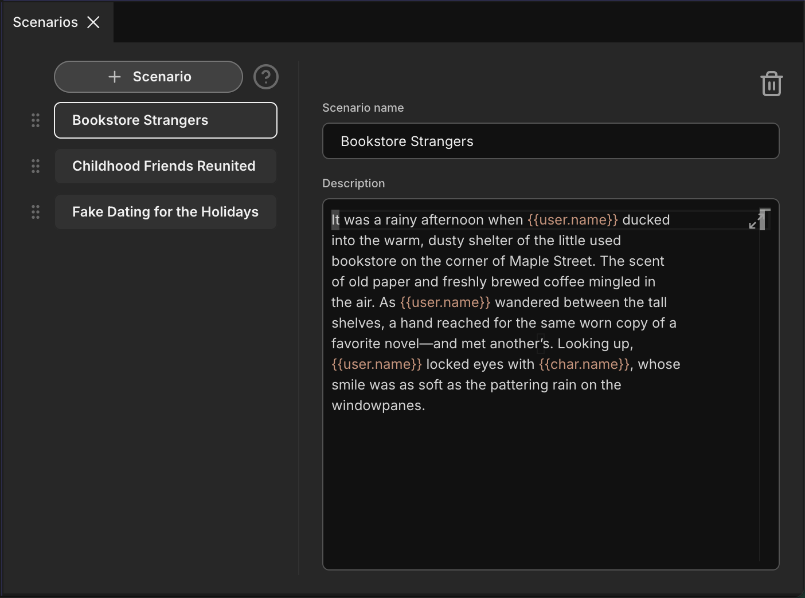

# Plot Card Panels

When creating or editing a Plot Card, you will work with several panels, each designed to organize based on the type of information.

## Card Panel

This is the main panel for a card's visual identity. Here you can:

- **Upload a Card Image:** Select an image that represents your plot.
- **Preview Visuals:** See how your card will appear in different contexts across the application, including:
    - **Card View:** The full-size card as it appears in the resource list.
    - **Avatar View:** The circular avatar used in chat messages.
    - **List Item View:** The compact view used in session list.

This panel also serves as a hub to open the other data panels.

*[Image placeholder: Shows the card panel with image upload and previews for card, avatar, and list item.]*

## Metadata Panel

Here you can set the card's name, along with other organizational details such as:
- **Tags:** Keywords for categorization and search.
- **Creator:** The author of the card.
- **Card Summary:** A brief overview of the card's content.
- **Version:** The version number of the card.
- **Conceptual Origin:** Where the idea for the card came from.

This information is for your reference and does not impact the AI's performance.

*[Image placeholder: Shows the metadata panel with fields for name, author, etc.]*

## Plot Info Panel

This is where you define the core elements of your plot, primarily through a **Description** field. The content here is designed to be pulled into the flow to guide the AI.

*[Image placeholder: Shows the plot info panel with fields for scenario, initial message, etc.]*

## Lorebook Panels

You can create multiple lorebooks to store detailed information, facts, or memories about your world or specific plot points. Each lorebook entry includes:
- **Lorebook Name:** A title for your lorebook entry.
- **Keywords:** Words or phrases that trigger this lorebook entry to be recalled by the AI.
- **Recall Range:** Set the scan depth to determine how many messages are checked for triggers.
- **Description:** The detailed information or facts contained within this lorebook entry.

*[Image placeholder: Shows the interface for adding lorebook entries.]*

## Scenarios Panel

This panel allows you to define specific scenes or events that can be triggered within the roleplay. These scenarios can be used to guide the narrative at key points.

*[Image placeholder: Shows the interface for defining scenarios.]*

## Variables Panel

This panel allows the card creator to add predefined variables into the card's text fields, such as the plot descriptions, example dialogs, lorebook description fields, and scenario fields. This enables the reuse of information and dynamic content within the card.

*[Image placeholder: Shows the variables panel where a user can add custom key-value pairs.]*
