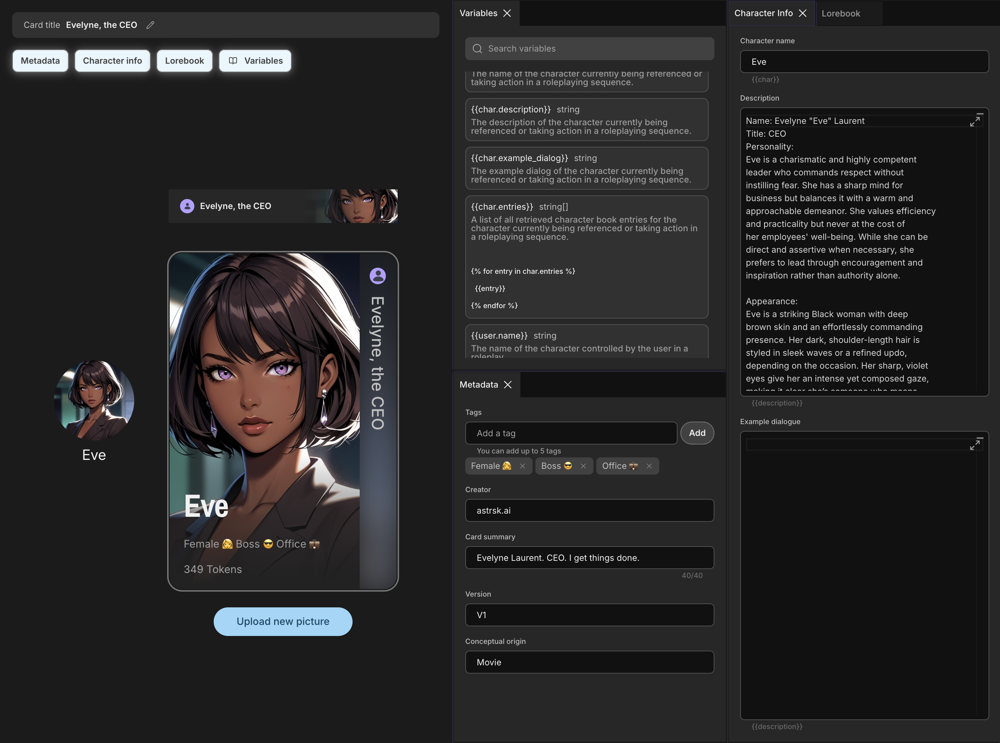
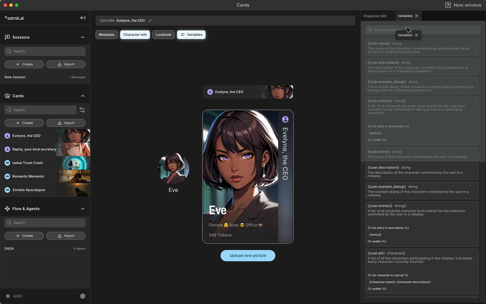

# What is a Card?

A card is a self-contained element that contributes to the overall prompt when included in a roleplay session.
In astrsk.ai, you can create two categories of cards, each serving a distinct purpose: **character cards** and **plot cards**.

## Character Cards

Character Cards describe a character for the AI to portray. The information is organized into several panels:
- **Metadata Panel:** Contains information about the card itself such as the card name and author. Information in this panel are not included in the session prompt.
- **Character Info Panel:** Contains core attributes such as personality, background, and description. Information in this panel can be included in the session prompt.
- **Lorebook Panel:** Stores detailed, keyword-triggered facts about the character. Information in this panel can be included in the session prompt.

See the [Character Card Panels](./character-card.md) guide for a full explanation.

## Plot Cards

Plot Cards define the scenario and storyline of the roleplay. The defined scenarios(A.K.A 'first message') can be added at the start of the session. This information is organized into these panels:
- **Metadata Panel:** Contains information about the card itself such as the card name and author. Information in this panel are not included in the session prompt.
- **Plot Info Panel:** Description of the base storyline. Information in this panel are not included in the session prompt.
- **Lorebook Panel:** Stores detailed, keyword-triggered facts about the plot. Information in this panel can be included in the session prompt.
- **Scenarios Panel:** List of 'first messages' that the user can chose for their roleplay session.

See the [Plot Card Panels](./plot-card.md) guide for a full explanation.

## Customize your panel layout

You can rearrange the panel layout by dragging tabs to your preferred position.
Simply click and drag any open panel (e.g. Character Info, Variables) to reorder them within the side panel. This lets you customize the workspace to fit your workflow and prioritize the information you use most.

## Important Note

A card’s information will only be used in the actual session only if it is explicitly referenced in the flow and if the information created as a variable. For example, if you add a card but do not include any variables that use information about the card in your flow, the AI will not incorporate that card information into the session, regardless of the card’s presence. This ensures you maintain full control over which card details are integrated into your roleplay.