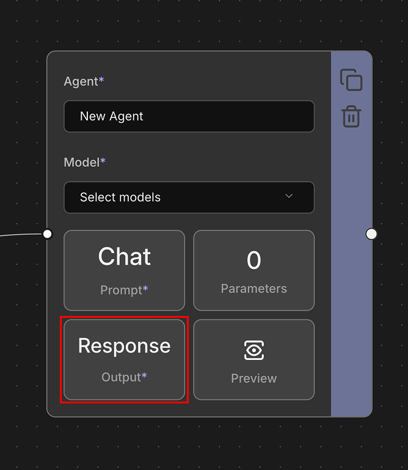
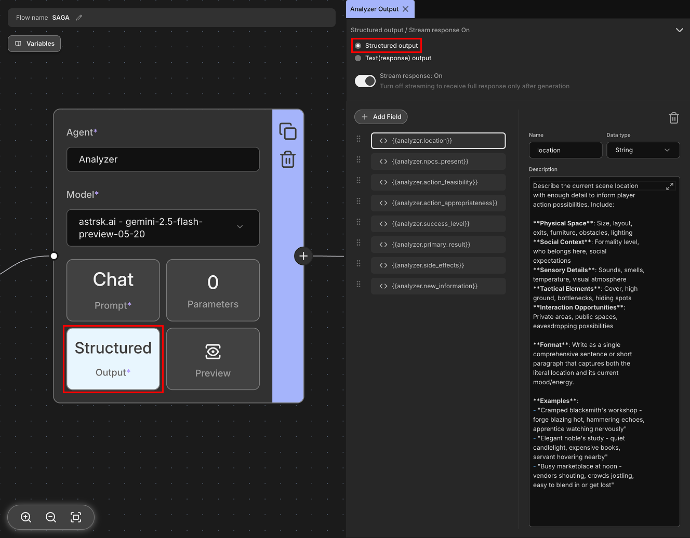
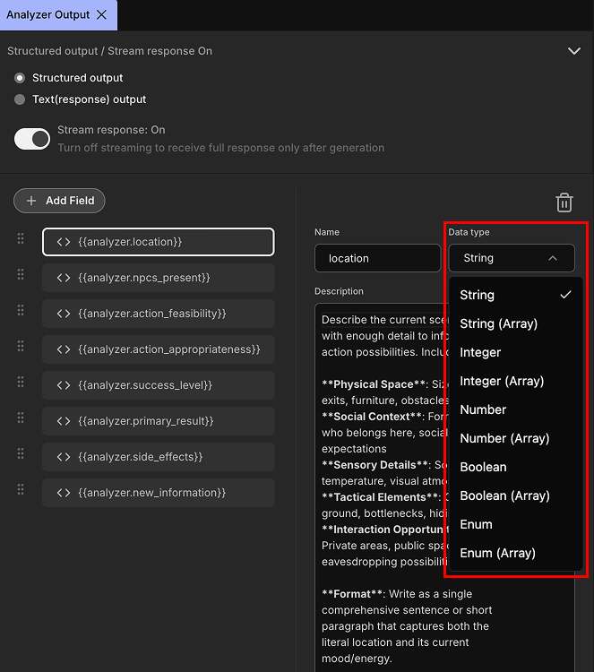
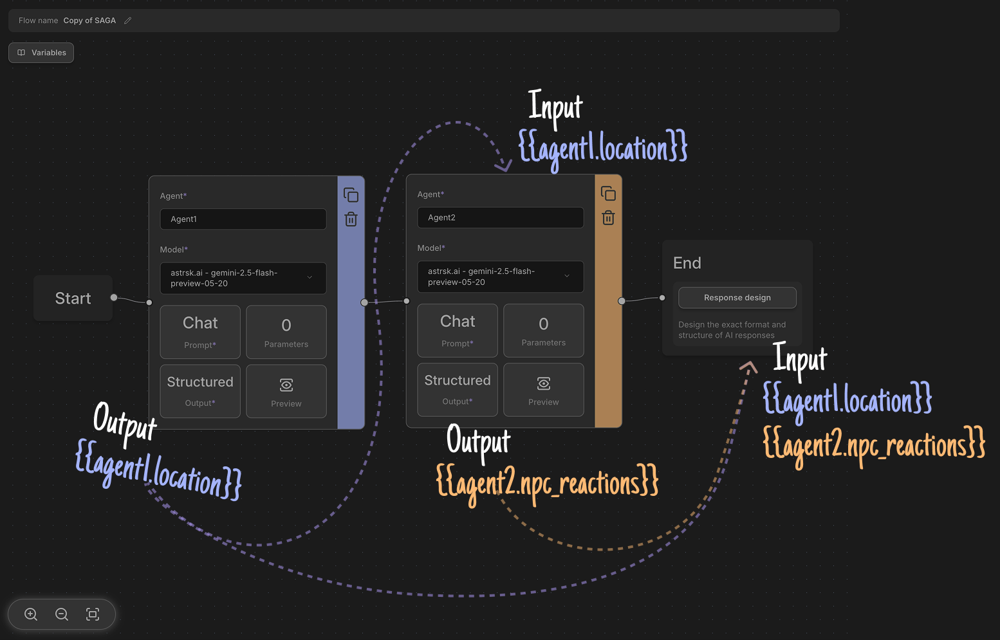

# Output

You can determine the format in which the agent responds and whether to use streaming.

## Output Format

### Structured Output

Makes the agent respond in a specific structured format. The model generates responses based on the name, type, and description of each field you define. This ensures consistent, parseable output that can be easily processed by other systems or used in subsequent flow nodes.

#### Data Type

- `String`: Text values. Used for any textual content like character actions, dialogue, or narration.
- `Integer`: Whole numbers without decimal points (e.g., 1, 42, -5). Useful for counts, IDs, or rankings.
- `Number`: Numeric values including decimals (e.g., 3.14, 2.5, -1.75). Used for measurements, scores, or calculations.
- `Boolean`: True or false values. Used for yes/no questions, flags, or binary states.
- `Enum`: A predefined set of specific values to choose from. Ensures the model selects only from allowed options, providing better control over possible outputs.
- `* (Array)`: A list of items of the specified type. Can contain multiple values of any other data type (e.g., array of strings, array of numbers). 

### Text (Response) Output

Generates the model's response as free-form text based on the context input through the prompt. For Chat completion, it generates an `assistant` message, and for Text completion, it continues the input text.

The model's response is stored as a variable with a prefix that converts the agent's name to `snake_case`. For example, if the agent name is `Test`, the response is stored in the `test.response` variable. This format is ideal when you need natural, unstructured text output.

## Chaining Agent Outputs as Inputs

Agent outputs are automatically stored as variables that can be seamlessly integrated into other parts of your workflow. When an agent generates a response, the output is saved using the agent's name converted to snake_case format (e.g., an agent named "Character Creator" becomes `character_creator.response`).

These stored outputs can then be used as inputs for:

- **Other Agents**: Pass one agent's response directly into another agent's prompt or context. For example, a character generation agent's output can feed into a dialogue creation agent.
- **Response Design**: Reference agent outputs in your response templates using variables like `{{agent_name.response}}` to dynamically incorporate generated content into your final presentation.

This variable-based system enables you to create sophisticated multi-step workflows where each agent builds upon previous outputs, creating rich, interconnected AI experiences that can process and transform data through multiple stages of your flow.

## Stream Response

Determines whether to receive responses in streaming format as generation begins, or to receive them all at once after generation is complete.

Streaming provides real-time updates as the model generates text, offering better user experience and responsiveness. However, some providers may filter content during streaming and stop the response mid-generation. Non-streaming mode waits for the complete response before returning it, which can be more reliable but less responsive. Choose the appropriate method based on your agent's purpose and provider capabilities.

