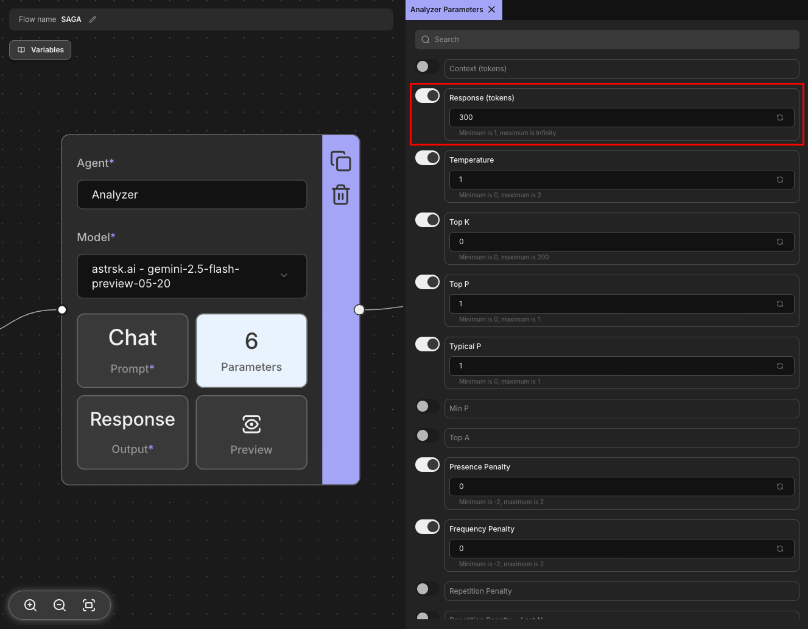
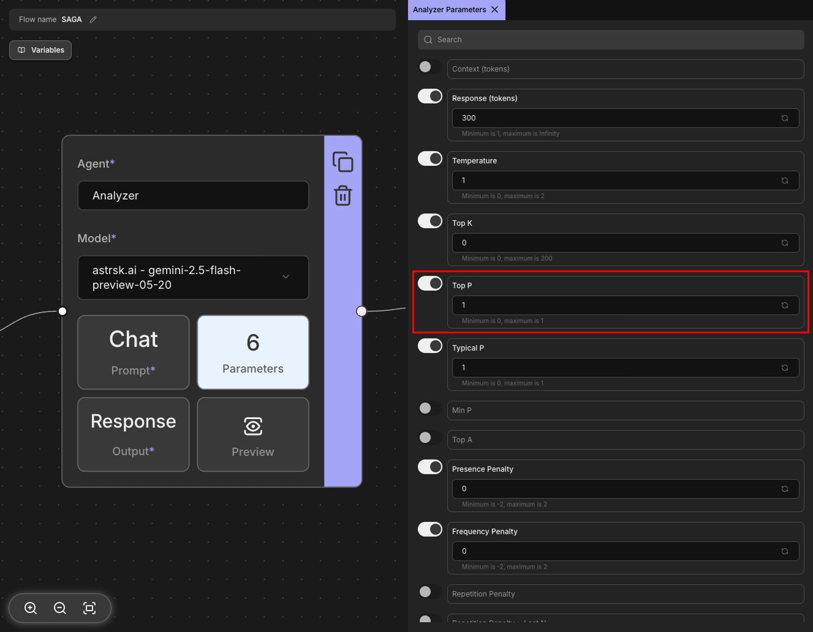

# Parameters

Parameters are configuration settings that control how the LLM generates responses. These settings influence the model's behavior, creativity, randomness, and output characteristics. By adjusting parameters, you can fine-tune the model's responses to match your specific needs, whether you want more creative and varied outputs or more focused and deterministic results.

## Core Parameters

The following parameters are commonly available across most providers and form the foundation of LLM response control.

### Response (tokens)

Controls the maximum number of tokens (words/word pieces) the model can generate in its response. This parameter helps manage response length and prevents excessively long outputs. Setting a lower value creates shorter responses, while higher values allow for more detailed outputs.

### Temperature

Controls the randomness and creativity of the model's responses. Lower values make outputs more focused and deterministic, while higher values increase creativity and variability. A temperature of 0 makes the model always choose the most likely next token, resulting in consistent outputs, while higher values introduce more randomness. Note that the temperature range may vary depending on the provider.

### Top K

Limits the model's token selection to the K most likely next tokens at each step. For example, with Top K set to 50, the model only considers the 50 most probable tokens when generating the next word. Lower values make responses more focused, while higher values allow more diverse word choices.

### Top P

Also known as nucleus sampling, this parameter considers tokens based on their cumulative probability mass. With Top P set to 0.9, the model considers the smallest set of tokens whose probabilities add up to 90%. This creates a dynamic vocabulary size that adapts to the prediction confidence at each step, often working more effectively than Top K for maintaining quality while allowing creativity.

### Presence Penalty

Reduces the likelihood of the model repeating topics or concepts that have already appeared in the conversation. Higher values encourage the model to explore new topics and avoid redundancy. This parameter applies penalties based on whether a token has appeared before, regardless of frequency. It's particularly useful for maintaining diverse and engaging conversations.

### Frequency Penalty

Penalizes tokens based on how frequently they appear in the generated text. Unlike Presence Penalty, this parameter increases the penalty proportionally to how often a token has been used. Higher values reduce repetitive words and phrases, encouraging more varied vocabulary usage. This helps prevent the model from getting stuck in repetitive patterns.

## Additional Parameters

Some providers offer additional parameters beyond the core set. These provider-specific parameters may include options for controlling output format, safety filters, advanced sampling techniques, or model-specific settings like repetition penalties, logit bias, or streaming options. For detailed information about these additional parameters, please refer to your specific provider's documentation.
