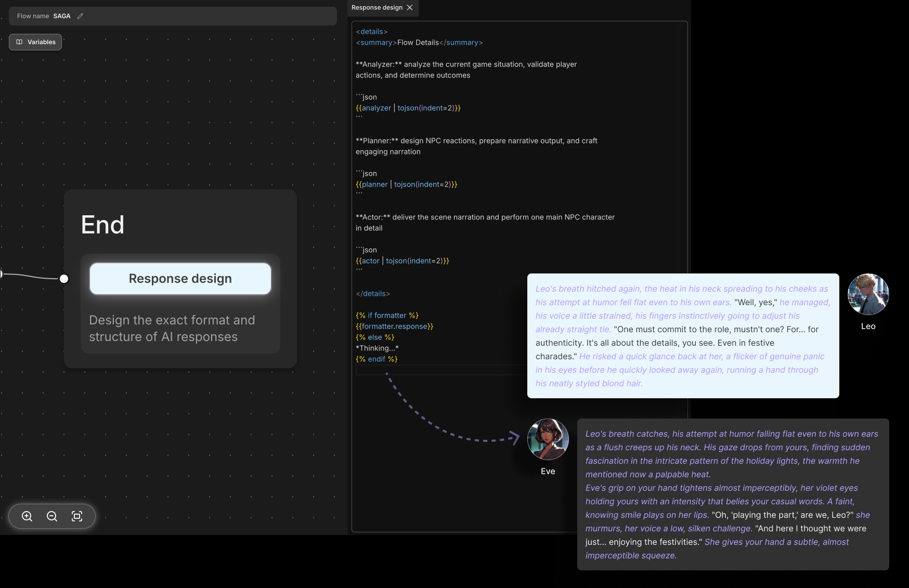

# End node

The End node is where the flow terminates. It integrates the results of all executed agents to create the character's response.

## Response Design

Design the character's response using System variables and Agent node outputs in Jinja templates. It supports Markdown syntax by default and allows the use of basic HTML tags.

