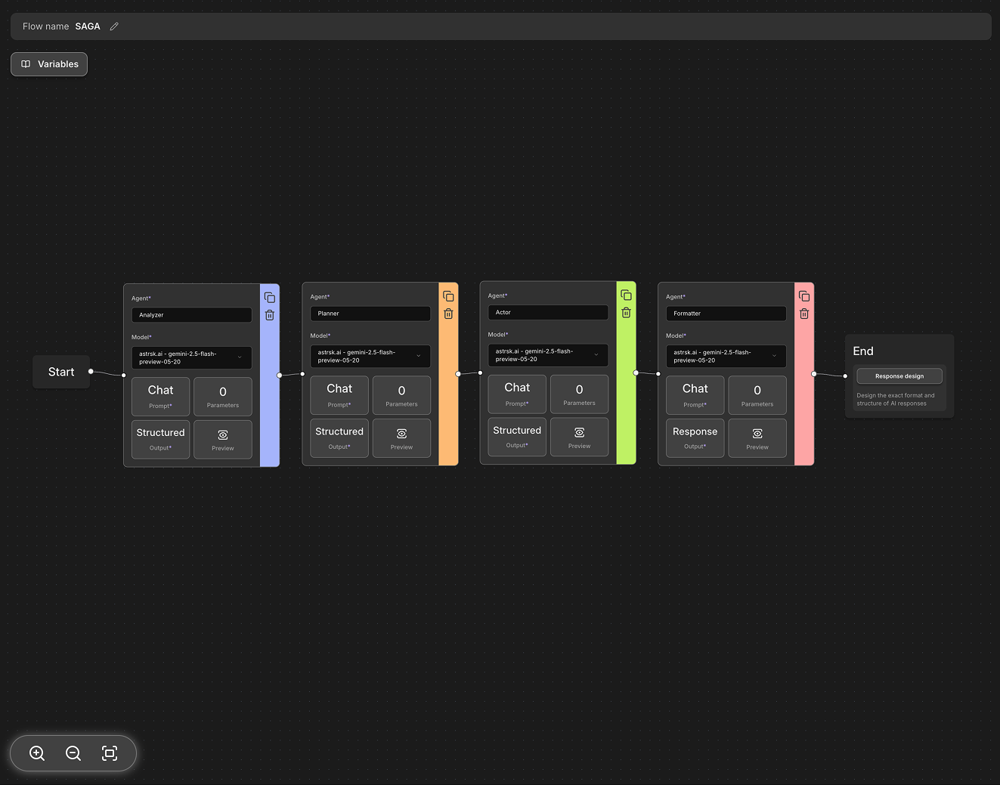
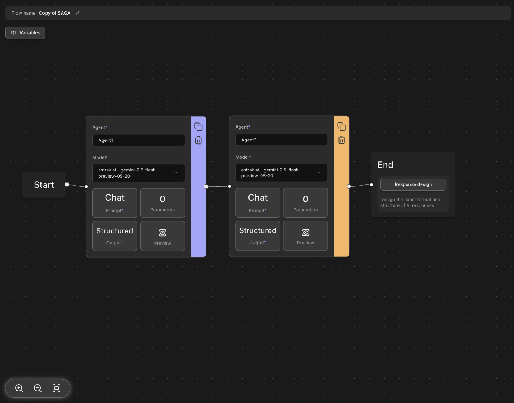

# What is a Flow?

## Concept

Flow is set of sequencially linked nodes that execute to create a response for a roleplay session.
A flow has to be connected from the start node to the end node (with the agent nodes in between) for it to execute properly.



## Basic Components

### Node

A node is the basic execution unit of a flow. Nodes come in three types:
- **Start node**: The start node is where the flow begins. .
- **Agent node**:
    - An agent calls an AI model and obtains an output that can be used later in other agents or in response design.
    - Agents can take on different responsibities depending on the nature of the roleplay and the AI model used.
- **End node**:
    - The end node is where the flow ends.
    - In the end node, users can use the response design feature to customize how the AI reponse in displayed during the roleplay session.


### Edge

An edge is a connection line between nodes. Nodes are executed sequentially according to the edges connected from the start node to the end node.
Edges serve the following roles:
- **Defines Execution Order**: Determines when each node will be executed.
- **Controls Data Flow**: Determines the path through which context/information is processed.

### Variables

Each node can utilize variables stored in the context using template syntax.
Variables can be referenced in the form `{{variable_name}}` and used in node input fields or prompts.

For example:
- `{{char.name}}`: The name of the character currently being referenced or taking action in a roleplaying sequence.
- `{{user.description}}`: The description of the character controlled by the user in a roleplay.
- `{{session.entries}}`: A list of all retrieved character and plot entries.

There are two types of variables in astrsk.ai:
- **(System) variables**: Basic variables that is provided by the application. These can be used in any flow or card.
- **Agent output**: Output data from an agent node. Agent outputs are restricted to use within the flow where they were generated.


## Example

Here's a simple flow example using two agents:

```
Start Node → Agent 1 (Input Analysis) → Agent 2 (Response Generation) → End Node
```

**Execution Process:**
1. **Start Node**: Initial context setup (character information, conversation history, etc.)
2. **Agent 1 (Input Analysis)**: Analyzes user input to generate `{{user_intent}}` and `{{context_summary}}` variables
3. **Agent 2 (Response Generation)**: Uses Agent 1's analysis results along with `{{char.description}}`, `{{char.example_dialog}}`, etc. to generate `{{char_response}}` variable
4. **End Node**: Outputs `{{char_response}}` content as character message

Context accumulates at each step, and the next node can utilize the results from previous nodes.



## References

For a complete list of available variables and detailed information about each variable, please refer to the [Variable Reference](/flow/variable-reference). Here you can find data types, usage methods, and examples for each variable.
