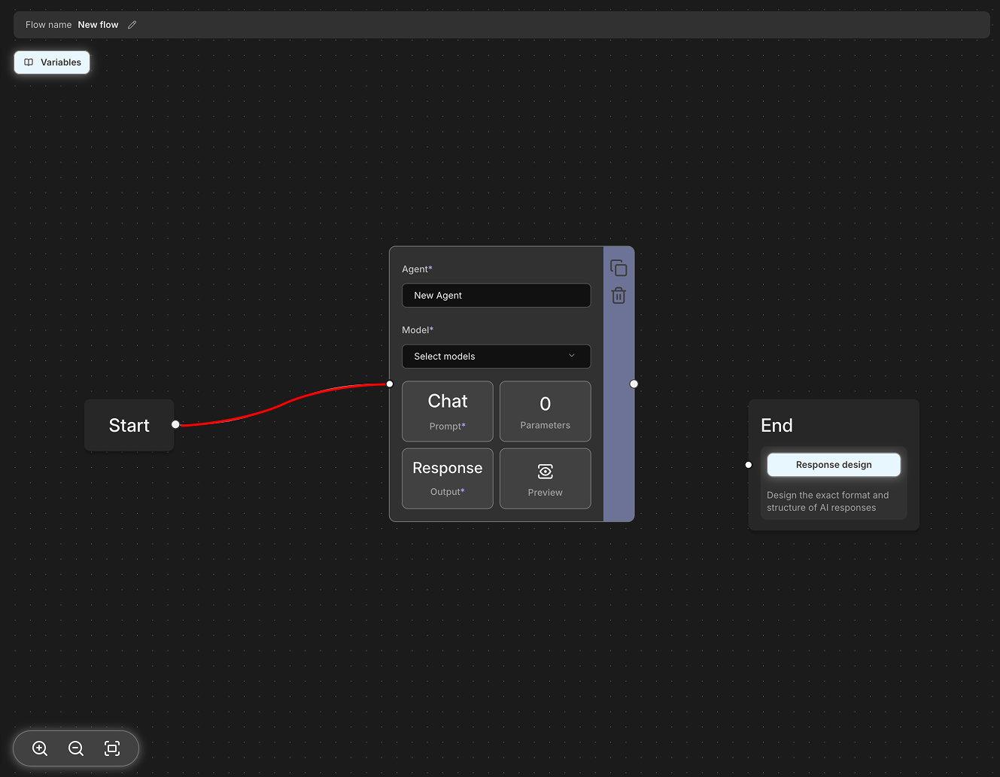

# What is the Flow?

## Concept

Flow is a structured process in astrsk.ai for systematically handling complex tasks. It breaks down large tasks into smaller units and executes them sequentially to produce final results.


## Basic Components

### Node

A node is the basic execution unit of a flow. Each node is responsible for a specific function or task.

Nodes have the following characteristics:
- **Input**: Receives context from the previous node
- **Process**: Performs unique functions (e.g., text analysis, image processing, data transformation)
- **Output**: Stores processing results as variables in the context and passes them to the next node


### Edge

An edge is a connection line between nodes. Nodes are executed sequentially according to the edges connected from the start node to the end node.

Edges serve the following roles:
- **Execution Order Definition**: Determines when each node will be executed
- **Data Flow Control**: Determines the path through which context is passed



## Context and Variables

Context is a space that stores all data and state information generated during flow execution. It serves as the "memory" of the flow.

### Initial Context Setup

Session information is initialized in the context based on the time when the flow is triggered. For example:
- Information about character cards included in the session
- Previous session history
- Activated lorebook entries

### Variable Usage

Each node can utilize variables stored in the context using template syntax. Variables can be referenced in the form `{{variable_name}}` and used in node input fields or prompts.

For example:
- `{{char.name}}`: The name of the character currently being referenced or taking action in a roleplaying sequence.
- `{{user.description}}`: The description of the character controlled by the user in a roleplay.
- `{{session.entries}}`: A list of all retrieved character and plot entries.


## Example

Here's a simple flow example using two agents:

```
Start Node → Agent 1 (Input Analysis) → Agent 2 (Response Generation) → End Node
```

**Execution Process:**
1. **Start Node**: Initial context setup (character information, conversation history, etc.)
2. **Agent 1 (Input Analysis)**: Analyzes user input to generate `{{user_intent}}` and `{{context_summary}}` variables
3. **Agent 2 (Response Generation)**: Uses Agent 1's analysis results along with `{{char.description}}`, `{{char.example_dialog}}`, etc. to generate `{{char_response}}` variable
4. **End Node**: Outputs `{{char_response}}` content as character message

Context accumulates at each step, and the next node can utilize the results from previous nodes.


## References

For a complete list of available variables and detailed information about each variable, please refer to the [Variable Reference](/flow/variable-reference). Here you can find data types, usage methods, and examples for each variable.
