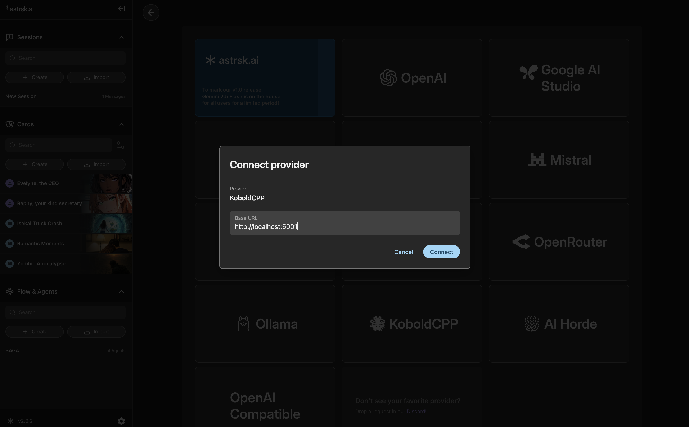

# Connect KoboldCPP

[KoboldCPP](https://github.com/LostRuins/koboldcpp) is an application that allows you to run AI models directly on your local device.

## Install KoboldCPP

Refer to [this document](https://github.com/LostRuins/koboldcpp/blob/concedo/README.md#windows-usage-precompiled-binary-recommended) for instructions on installing KoboldCPP.

## Get Models

KoboldCPP runs `*.gguf` model files. These files can be found on platforms like [HuggingFace](https://huggingface.co/).

Find the appropriate model on HuggingFace and download the GGUF file. For example, [this](https://huggingface.co/unsloth/phi-4-GGUF/blob/main/phi-4-Q4_K_M.gguf) is the GGUF file for the phi-4 model.

## Start KoboldCPP

Once you have your model file, run KoboldCPP. In the **Quick Launch** menu, click **GGUF Text Model** to select the model you downloaded.

Then, click **Launch** and wait a moment. The KoboldCPP UI will open in your browser. You can close this browser tab as we will be using astrsk.ai.

## Connect KoboldCPP in astrsk.ai

Within astrsk.ai, navigate to the provider settings. Select **KoboldCPP** as the source, verify the **Base URL** (default `http://localhost:5001`), and then press **Connect**. Check the model list to ensure your models are available.

