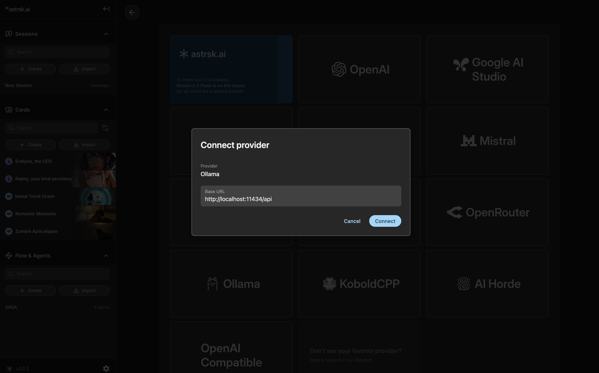

# Connect Ollama

[Ollama](https://ollama.com/) is an application that allows you to run AI models directly on your local device.

## Install Ollama

Refer to [this document](https://github.com/ollama/ollama/blob/main/README.md) for instructions on installing Ollama on your system.

## Get Models

From your terminal, run the following command to download the desired model (e.g., `llama3.1:8b`):

```bash
ollama pull llama3.1:8b
```

## Set Environment Variable

To allow astrsk.ai to connect to your local Ollama instance, you need to set the `OLLAMA_ORIGINS` environment variable. Refer to [this document](https://github.com/ollama/ollama/blob/main/docs/faq.md#how-do-i-configure-ollama-server) for instructions on setting environment variables for your operating system.

```bash
OLLAMA_ORIGINS="https://app.astrsk.ai"
```

After setting the environment variable, **restart your terminal or command prompt** for the changes to take effect.

## Start Ollama

Start the Ollama server by clicking the Ollama application icon in your app list, or by running the following command in your terminal:

```bash
ollama serve
```

## Connect Ollama in astrsk.ai

Within astrsk.ai, navigate to the provider settings. Select **Ollama** as the source, verify the **Base URL** (usually `http://localhost:11434/api`), and then press **Connect**.


