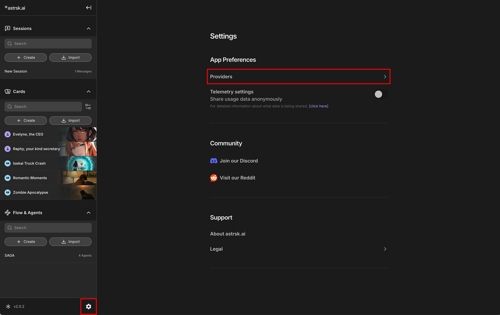

# What are Providers?

## Understanding Providers

A **Provider** is a service or platform that offers access to various Artificial Intelligence (AI) models. In astrsk.ai, providers are the gateways through which you can access different AI capabilities to power your roleplay sessions.

## Providers and Models

Providers make **Large Language Models (LLMs)** available. An LLM is an AI trained to generate human-like text. In astrsk.ai, LLMs power AI roleplay by generating character responses, interpreting prompts, and creating immersive roleplays. They are the foundation for all storytelling, structured interactions, and lifelike roleplaying tailored to user-defined settings.

astrsk.ai supports integration with multiple AI providers, allowing you to choose the best model for your specific needs and preferences.

## Accessing Providers

You can manage and configure your AI providers by going to the Settings > Providers.

This allows you to add new providers or update existing ones.
