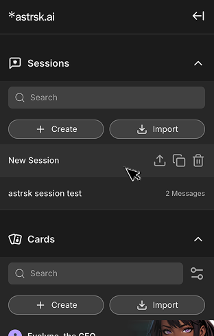

# Clone/Delete/Export a Session

These actions will appear when hovering over a session item in the session list.

## Clone a Session

Creates a copy of the session. No additional setup required.

## Delete a Session

Permanently removes the selected session. Does not remove cards and flow that are used in the session.

## Export a Session

Exports the session data to a .session file. The .session file includes copies of the included cards and flow.

