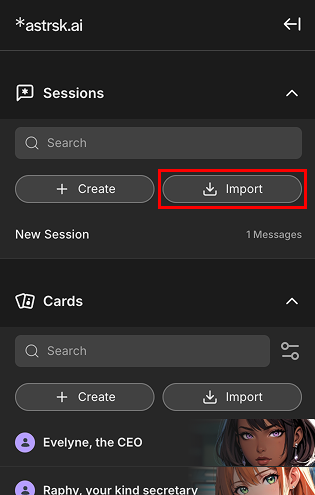

# Import a Session

## Import Session Steps

Click the [+ Import] button at the top of the sessions list in the *resource panel*. This opens the file selection window, allowing you to bring in roleplay sessions.

Select a session file. Choose the file you want to import from your device. This file should contain previous roleplay interactions along with the cards and flow that are used in the session.

Once the import is successful, you'll need to select models for each agent.

Lastly, select whether to include the chat history of the original import so that you can continue where it was left off.

