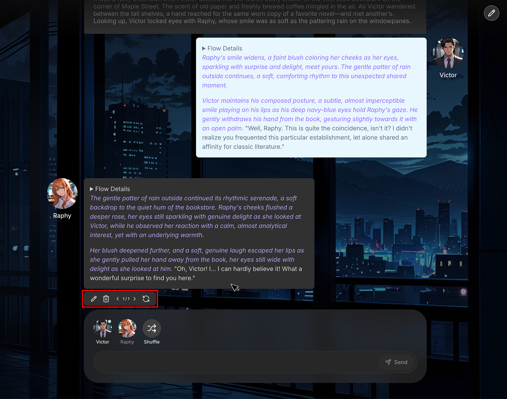

# Session Play

Clicking on a particular session will take you to the main session scree. This is where you interact with the AI and play your session.

## Sending Messages

At the bottom of the screen, you will find a message input box. Type your message here and press Enter or the send button to send your message.
If you want AI to create a response for your character, click on your character button above the message input box. The AI, using the session's flow, will gerenate a response for you.

## Generating AI Responses

### 1-on-1 Chat

In 1:1 session with one AI character, the AI will respond automatically after you send a message. You can also use the character's button to manually trigger a response at any time.

### Group Chat

In a group chat with multiple AI characters, you must explicitly press a character button to make them speak. The AI will not respond automatically.
If you want any random of the charcters to answer, click the [Shuffle] button.

## Editing Messages

You can edit, delete, or reroll any message in the chat history. Hover your mouse over a message, and a control panel will appear at the bottom of that message bubble.

- **Edit:** Allows you to change the content of the message.
- **Delete:** Removes the message from the chat.
- **Reroll:** AI will generate a new response for that turn.

