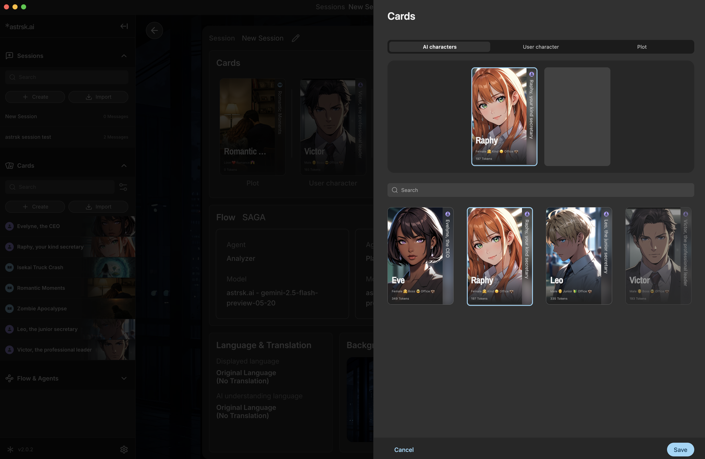
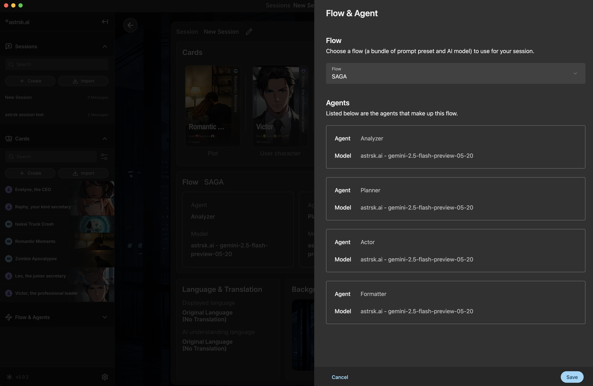
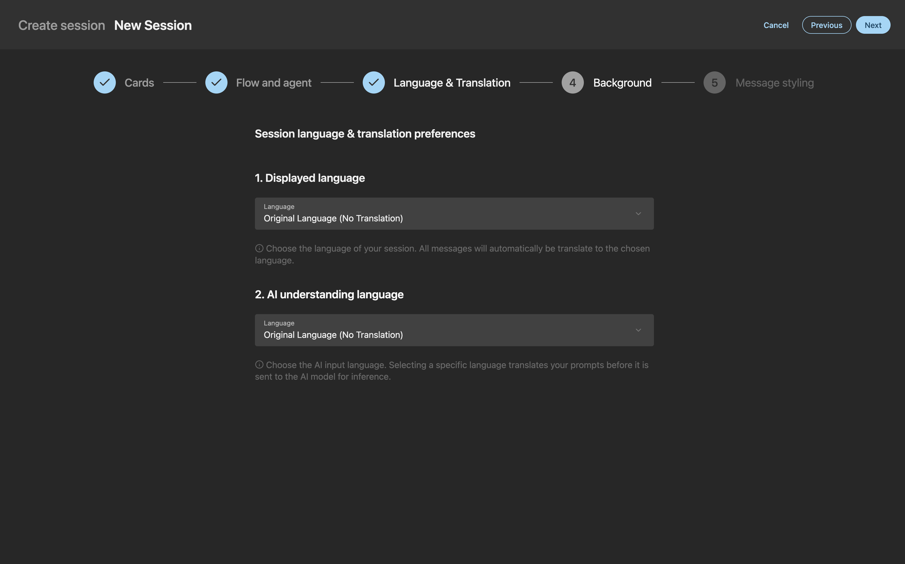
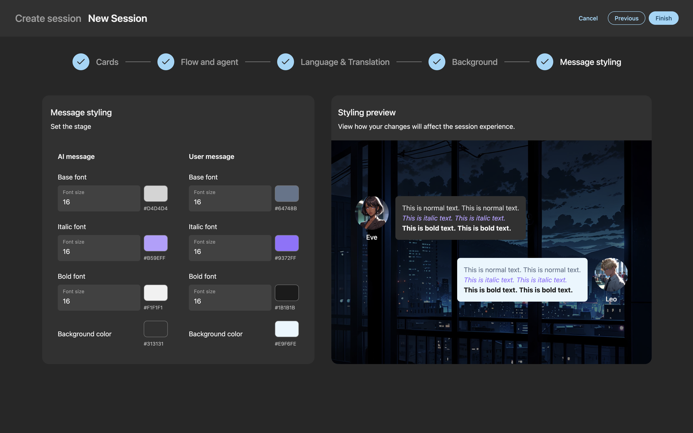

# Session Settings

## Accessing Settings

Access session settings through a floating button on the top right corner of the session-play screen. This opens the settings screen and where all the edit options will be available.

## Session Edit

## Cards

Add or remove cards that are used in the session. Although adding and removing cards are possible on the session edit screen, the card information must be edited from the cards screen.

## Flow and agents

Switch the flow for the session. The flow determines how the AI interacts with the session data such as cards and session history.
Although switching flow is possible on the session edit screen, the flow information must be edited from the flow screen.

## Language & Translation

Choose which language the session will be conducted in by editing the language and translation settings for the current session.
Use the [Displayed language] option to translate any message to a particular language and use the [AI prompt language] option to choose the target language in which the prompt is translated and sent.

## Background

Select a background image of the for the current session. Import images to use as your background by clicking the [+ Add Background] button.

## Message Styling

Customize the chat message font and color for the current session. Refer to the [Preview] UI to check how the aesthetic of your play environment changes.

